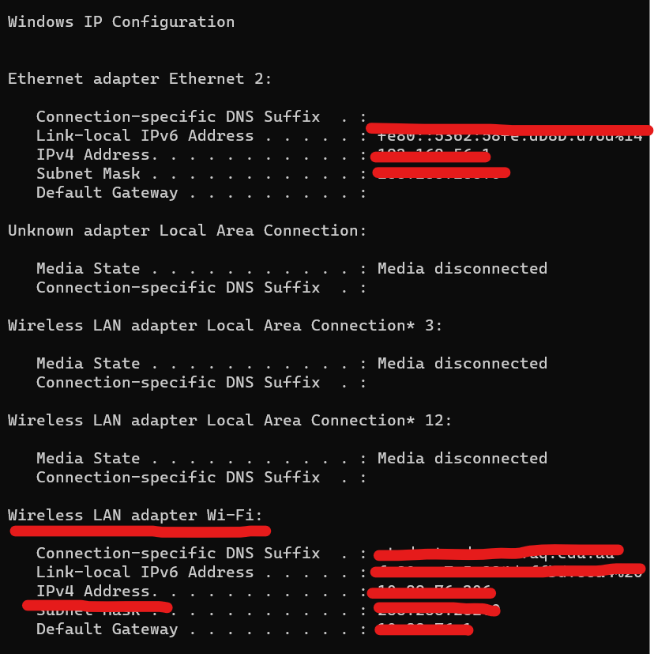
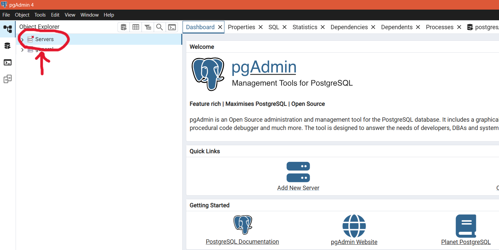
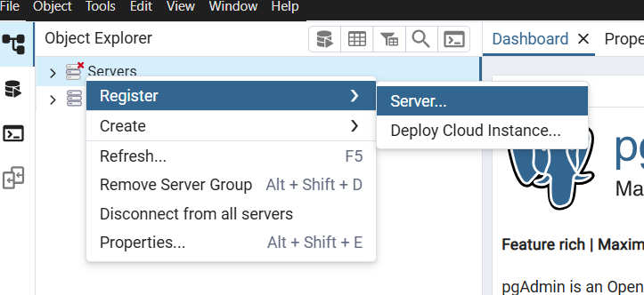

# SquadLock
SquadLock is aimed to prevent distracting side quests
## Features
- Join your friends/organisation and take down that deadline
- See who stays disciplined by not trying to visit blocked websites through point tracking
- Shames your friends through Discord messages whenever they are caught lacking
- Create personalised block targets and reduce distracting background thoughts
- Balance work and leisure through blocked out time periods

## Installation
> [!NOTE]
> This extension requires PostgreSQL to track user data and filters.  
> Please follow the installation guide on [W3 Schools](https://www.w3schools.com/postgresql/postgresql_install.php), then follow [these steps](#postgres-setup)

There are two server hosting options:\
[Localhost - personal use](#localhost-anchor)\
[LAN - shared use](#lan-anchor)

### <a name="localhost-anchor"></a>Localhost installation
1. Download the latest release, and extract the zip.  
Ensure you have the required [libraries](#library-installation) installed.

2. Please uncomment the variables located in the following filepaths.
   (These constants come set for private LAN hosting).
```javascript
FILEPATH: frontend/js/lib/constants.js
API_ENDPOINT = 'http://localhost:5001';
WS_ENDPOINT = 'ws://localhost:5001';

FILEPATH: src/queries.py
DATA_HOST = 'localhost'
```

### <a name="lan-anchor"></a>LAN installation
1. Download latest release, extract, and check required [libraries](#library-installation) are installed.
2. Find your LAN IP by opening Command Prompt (Terminal on MacOS), and run ```ipconfig```. Locate the 
```Wireless LAN adapter Wi-Fi``` header, and copy paste the IPv4 address.


3. Please uncomment the variables located in the following filepaths.
   (These constants come set for private LAN hosting).
```javascript
FILEPATH: frontend/js/lib/constants.js
API_ENDPOINT = 'http://LANIP:5001';
WS_ENDPOINT = 'ws://LANIP:5001';

FILEPATH: src/queries.py
DATA_HOST = 'LANIP'
```
4. Navigate to your browser, and type into your search bar:
   ```chrome://extensions```
5. 
   - Enable the **Developer Mode** switch at the top right corner. 
   - A **Load Unpacked** icon should appear. 
   - Click into it, and upload the **frontend** directory.
6. The extension is now installed.


### <a name="postgres-setup">Postgres Server Setup:</a>
1. Open PostgreSQL, and then navigate to the top left corner where you will see Servers.


2. From here, right click into server, then follow the path below.\


3. Give your new server any name, and specify the connection in host name/address. If you want to host only locally, insert 127.0.0.1. 
> [!IMPORTANT]
> Ensure your IP addresses previously configured back in step 2 of [Installation](#localhost-installation) is the same as the one inserted into Postgres

Otherwise, put in any private LAN IP address.
Keep the port as 5432, and enter password 1234.
> [!NOTE]
> You can change this by accessing:
> ```javascript
> FILEPATH: src/queries.py
> PASSWORD: YOURPASSWORD (default: '1234')


### <a name="library-install">Library Installation:</a>
The following libraries are required to run the server:
```javascript
pip install flask
pip install flask-sock
pip install discord-webhook
pip install psycopg2
```

